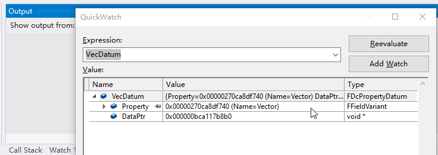

# Examples

This page shows some short and quick examples showcasing DataConfig API usage and features. All code shown here can be found in the sources.

## JSON Deserialization

This is the example shown on front page. Given the struct`FDcTestExampleStruct`:

```c++
// DataConfig/DataConfig/Source/DataConfigTests/Private/DcTestBlurb.h
UENUM()
enum class EDcTestExampleEnum
{
    Foo, Bar, Baz
};

USTRUCT()
struct FDcTestExampleStruct
{
    GENERATED_BODY()
    UPROPERTY() FString StrField;
    UPROPERTY() EDcTestExampleEnum EnumField;
    UPROPERTY() TArray<FColor> Colors;
};
```

We can deserialize an instance from JSON with the snippet below:

```c++
// DataConfig/Source/DataConfigTests/Private/DcTestBlurb.cpp
FString Str = TEXT(R"(
    {
        "StrField" : "Lorem ipsum dolor sit amet",
        "EnumField" : "Bar",
        "Colors" : [
            "#FF0000FF", "#00FF00FF", "#0000FFFF"
        ]
    }
)");

FDcTestExampleStruct Dest;

//  create and setup a deserializer
FDcDeserializer Deserializer;
DcSetupJsonDeserializeHandlers(Deserializer);
Deserializer.AddPredicatedHandler(
    FDcDeserializePredicate::CreateStatic(DcExtra::PredicateIsColorStruct),
    FDcDeserializeDelegate::CreateStatic(DcExtra::HandlerColorDeserialize)
);

//  prepare context for this run
FDcPropertyDatum Datum(FDcTestExampleStruct::StaticStruct(), &Dest);
FDcJsonReader Reader(Str);
FDcPropertyWriter Writer(Datum);

FDcDeserializeContext Ctx;
Ctx.Reader = &Reader;
Ctx.Writer = &Writer;
Ctx.Deserializer = &Deserializer;
Ctx.Properties.Push(Datum.Property);
DC_TRY(Ctx.Prepare());

//  kick off deserialization
DC_TRY(Deserializer.Deserialize(Ctx));

//  validate results
check(Dest.StrField == TEXT("Lorem ipsum dolor sit amet"));
check(Dest.EnumField == EDcTestExampleEnum::Bar);
check(Dest.Colors[0] == FColor::Red);
check(Dest.Colors[1] == FColor::Green);
check(Dest.Colors[2] == FColor::Blue);
```

Note that `EDcTestExampleEnum` is deserialized by its name and `FColor` is deserialized from a html color string like `#RRGGBBAA`.

Say if we accidentally mistyped the `EnumField` value:

```json
{
    "StrField" : "Lorem ipsum dolor sit amet",
    "EnumField" : "Far",
```

It would fail gracefully with diagnostics:

```
# DataConfig Error: Enum name not found in enum type: EDcTestExampleEnum, Actual: 'Far'
- [JsonReader] --> <in-memory>4:25
   2 |    {
   3 |        "StrField" : "Lorem ipsum dolor sit amet",
   4 |        "EnumField" : "Far",
     |                           ^
   5 |        "Colors" : [
   6 |            "#FF0000FF", "#00FF00FF", "#0000FFFF"
- [PropertyWriter] Writing property: (FDcTestExampleStruct)$root.(EEDcTestExampleEnum)EnumField
```

## Custom Deserialization Logic

To deserialize `FColor` with  `#RRGGBBAA` we'll need to provide custom logic to the deserializer. First you'll need to implement a  `FDcDeserializePredicate` delegate to pick out `FColor`:

```c++
//	DataConfig/Source/DataConfigExtra/Private/DataConfig/Extra/Deserialize/DcDeserializeColor.cpp
EDcDeserializePredicateResult PredicateIsColorStruct(FDcDeserializeContext& Ctx)
{
	UScriptStruct* Struct = DcPropertyUtils::TryGetStructClass(Ctx.TopProperty());
	return Struct && Struct == TBaseStructure<FColor>::Get()
		? EDcDeserializePredicateResult::Process
		: EDcDeserializePredicateResult::Pass;
}
```

Then we'll need to implement a `FDcDeserializeDelegate` to deserialize a `FColor`. Here we'll do it by writing through `R/G/B/A` fields by name with the `FDcWriter` API.

```c++
// DataConfig/Source/DataConfigExtra/Private/DataConfig/Extra/Deserialize/DcDeserializeColor.cpp
template<>
FDcResult TemplatedWriteColorDispatch<EDcColorDeserializeMethod::WriterAPI>(const FColor& Color, FDcDeserializeContext& Ctx)
{
	DC_TRY(Ctx.Writer->WriteStructRoot(FDcStructStat{ TEXT("Color"), FDcStructStat::WriteCheckName }));

	DC_TRY(Ctx.Writer->WriteName(TEXT("B")));
	DC_TRY(Ctx.Writer->WriteUInt8(Color.B));

	DC_TRY(Ctx.Writer->WriteName(TEXT("G")));
	DC_TRY(Ctx.Writer->WriteUInt8(Color.G));

	DC_TRY(Ctx.Writer->WriteName(TEXT("R")));
	DC_TRY(Ctx.Writer->WriteUInt8(Color.R));

	DC_TRY(Ctx.Writer->WriteName(TEXT("A")));
	DC_TRY(Ctx.Writer->WriteUInt8(Color.A));

	DC_TRY(Ctx.Writer->WriteStructEnd(FDcStructStat{ TEXT("Color"), FDcStructStat::WriteCheckName }));

	return DcOk();
}
```

Then we'll need to register these pair of delegates to the `FDcDeserializer`.

```c++
// DataConfig/Source/DataConfigTests/Private/DcTestBlurb.cpp
FDcDeserializer Deserializer;
DcSetupJsonDeserializeHandlers(Deserializer);
Deserializer.AddPredicatedHandler(
    FDcDeserializePredicate::CreateStatic(DcExtra::PredicateIsColorStruct),
    FDcDeserializeDelegate::CreateStatic(DcExtra::HandlerColorDeserialize)
);
```

And then it's done. It would work recursively on `FColor` everywhere, like in `UCLASS/USTRUCT` members, in `TArray/TSet` and in `TMap` as key or values.

## Writer API Alternatives

In the example above we're deserializing `FColor` by writing into its member fields separately, which is a bit dumb. In this case DataConfig do support better alternatives.

Since we know that `FColor` is POD type we can construct one by filling in correct bit pattern. In this case `FDcPropertyWriter` allow struct property to be coerced from a blob:

```c++
//	DataConfig/Source/DataConfigExtra/Private/DataConfig/Extra/Deserialize/DcDeserializeColor.cpp
template<>
FDcResult TemplatedWriteColorDispatch<EDcColorDeserializeMethod::WriteBlob>(const FColor& Color, FDcDeserializeContext& Ctx)
{
	return Ctx.Writer->WriteBlob({
		(uint8*)&Color,	// treat `Color` as opaque blob data
		sizeof(FColor)
	});
}
```

Alternatively we can get `FProperty` and data pointer in place and setting the value through Unreal's `FProperty` API:

```c++
// DataConfig/Source/DataConfigExtra/Private/DataConfig/Extra/Deserialize/DcDeserializeColor.cpp
template<>
FDcResult TemplatedWriteColorDispatch<EDcColorDeserializeMethod::WriteDataEntry>(const FColor& Color, FDcDeserializeContext& Ctx)
{
	FDcPropertyDatum Datum;
	DC_TRY(Ctx.Writer->WriteDataEntry(FStructProperty::StaticClass(), Datum));

	Datum.CastFieldChecked<FStructProperty>()->CopySingleValue(Datum.DataPtr, &Color);
	return DcOk();
}
```

Note that we already know that `Datum.DataPtr` points to a allocated `FColor` instance. Thus we can simply cast it into a `FColor*` and directly manipulate the pointer.

```c++
// DataConfig/Source/DataConfigExtra/Private/DataConfig/Extra/Deserialize/DcDeserializeColor.cpp
template<>
FDcResult TemplatedWriteColorDispatch<EDcColorDeserializeMethod::WritePointer>(const FColor& Color, FDcDeserializeContext& Ctx)
{
	FDcPropertyDatum Datum;
	DC_TRY(Ctx.Writer->WriteDataEntry(FStructProperty::StaticClass(), Datum));

	FColor* ColorPtr = (FColor*)Datum.DataPtr;
	*ColorPtr = Color;	// deserialize by assignment

	return DcOk();
}
```

## Debug Dump

`DcAutomationUtils::DumpToLog()` can dump a `FDcPropertyDatum` to a string representation, in which `FDcPropertyDatum` is simply a `FProperty` + `void*` pair that can represent anything in the property system:

```c++
// DataConfig/Source/DataConfigTests/Private/DcTestBlurb.cpp
FVector Vec(1.0f, 2.0f, 3.0f);
FDcPropertyDatum VecDatum(TBaseStructure<FVector>::Get(), &Vec);

DcAutomationUtils::DumpToLog(VecDatum);
```

Output would be:

```
-----------------------------------------
# Datum: 'ScriptStruct', 'Vector'
<StructRoot> 'Vector'
|---<Name> 'X'
|---<Float> '1.000000'
|---<Name> 'Y'
|---<Float> '2.000000'
|---<Name> 'Z'
|---<Float> '3.000000'
<StructEnd> 'Vector'
-----------------------------------------
```

Additionally we wrapped this into `gDcDebug` that can be invoked in MSVC immediate window. Calling it during debug would dump into MSVC **Output** window:

```c++
// DataConfig/Source/DataConfigCore/Public/DataConfig/Automation/DcAutomationUtils.h
struct DATACONFIGCORE_API FDcDebug
{
	FORCENOINLINE void DumpStruct(char* StructNameChars, void* Ptr);
	FORCENOINLINE void DumpObject(UObject* Obj);
	FORCENOINLINE void DumpDatum(void* DatumPtr);
};

///	Access `gDcDebugg` in MSVC immediate window:
///
///	- in monolith builds:
///	gDcDebug.DumpObject(Obj)
///
///	- in DLL builds prefix with dll name:
///	({,,UE4Editor-DataConfigCore}gDcDebug).DumpObject(ObjPtr)

extern FDcDebug gDcDebug;
```

Here's an animated demo showing dumping the vector above _during debug break_ in MSVC:



The full expression to evaluate is:

```
({,,UE4Editor-DataConfigCore}gDcDebug).DumpDatum(&VecDatum)
```

We need DLL name to locate `gDcDebug` in a non monolith build.

## More

There's more detailed examples in [DataConfigExtra](./Extra/DataConfigExtra.md) and [DataConfigEditorExtra](./Extra/DataConfigEditorExtra.md)