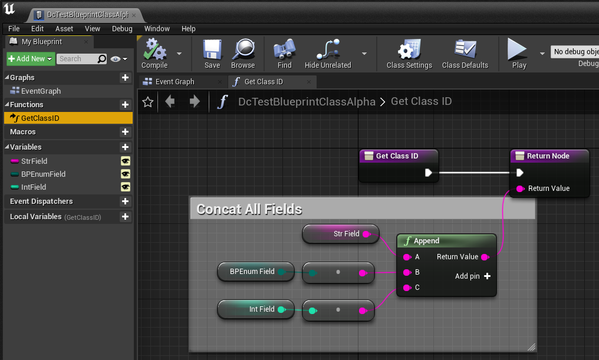
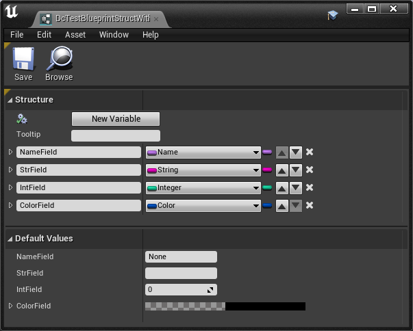

# Blueprint Serialization/Deserialization

The Property System is so powerful that you can create new Blueprint Class/Struct, which is equivalent to C++ `UCLASS/USTRUCT` to some extents. In this example we'll show how to handle these in DataConfig. 

The whole blueprint stuff depends on `Engine` module. This is also why we put related code into `DataConfigEditorExtra` module.

## Blueprint Class and Object references

Blueprint class are stored within `UBlueprint` typed assets. Note that we automatically unwrap the container in handlers.

* [DcSerDeBlueprint.h]({{SrcRoot}}DataConfigEditorExtra/Public/DataConfig/EditorExtra/SerDe/DcSerDeBlueprint.h)
* [DcSerDeBlueprint.cpp]({{SrcRoot}}DataConfigEditorExtra/Private/DataConfig/EditorExtra/SerDe/DcSerDeBlueprint.cpp)


```c++
//DataConfigEditorExtra/Public/DataConfig/EditorExtra/SerDe/DcSerDeBlueprint.h
USTRUCT()
struct DATACONFIGEDITOREXTRA_API FDcEditorExtraTestStructWithBPClass
{
    GENERATED_BODY()

    UPROPERTY() TSubclassOf<UDcTestBPClassBase> ClassField1;
    UPROPERTY() TSubclassOf<UDcTestBPClassBase> ClassField2;
    UPROPERTY() TSubclassOf<UDcTestBPClassBase> ClassField3;
};

USTRUCT()
struct DATACONFIGEDITOREXTRA_API FDcEditorExtraTestStructWithBPInstance
{
    GENERATED_BODY()

    UPROPERTY() UDcTestBPClassBase* InstanceField1;
    UPROPERTY() UDcTestBPClassBase* InstanceField2;
    UPROPERTY() UDcTestBPClassBase* InstanceField3;
};

//DataConfigEditorExtra/Private/DataConfig/EditorExtra/SerDe/DcSerDeBlueprint.cpp
FString Str = TEXT(R"(
    {
        "ClassField1" : null,
        "ClassField2" : "DcTestNativeDerived1",
        "ClassField3" : "/DataConfig/DcFixture/DcTestBlueprintClassBeta"
    }
)");

FString Str = TEXT(R"(
    {
        "InstanceField1" : null,
        "InstanceField2" : "/DataConfig/DcFixture/DcTestBlueprintInstanceAlpha",
        "InstanceField3" : "/DataConfig/DcFixture/DcTestBlueprintInstanceBeta"
    }
)");
```

## Blueprint Class Instance

In this example we roundtrip a Blueprint class instance from JSON:



```c++
//DataConfigEditorExtra/Private/DataConfig/EditorExtra/SerDe/DcSerDeBlueprint.cpp
FString Str = TEXT(R"(
    {
        "StrField" : "Foo",
        "BPEnumField" : "Baz",
        "IntField" : 345
    }
)");
```

You can also reference on how to handle Blueprint enum in this example. It need some special care to convert between int value and the descriptive text set within the editor.

## Blueprint Struct Instance

Finally we're combined `FColor`, `FDcAnyStruct` and Blueprint struct into one single example:



```c++
//DataConfigEditorExtra/Private/DataConfig/EditorExtra/SerDe/DcSerDeBlueprint.cpp
FString Str = TEXT(R"(
    {
        "AnyStructField1" : {
            "$type" : "/DataConfig/DcFixture/DcTestBlueprintStructWithColor",
            "NameField" : "Foo",
            "StrField" : "Bar",
            "IntField" : 123,
            "ColorField" : "#FF0000FF"
        }
    }
)");
```

Under the hood Blueprint struct mangles its field names. The struct above dumps to something like this:

```
-----------------------------------------
# Datum: 'UserDefinedStruct', 'DcTestBlueprintStructWithColor'
<StructRoot> 'DcTestBlueprintStructWithColor'
|---<Name> 'NameField_5_97BFF114405C1934C2F33E8668BF1652'
|---<Name> 'Foo'
|---<Name> 'StrField_9_FAA71EFE4896F4E6B1478B9C13B2CE52'
|---<String> 'Bar'
|---<Name> 'IntField_11_3BC7CB0F42439CE2196F7AA82A1AC374'
|---<Int32> '123'
|---<Name> 'ColorField_14_F676BCF245B2977B678B65A8216E94EB'
|---<StructRoot> 'Color'
|   |---<Name> 'B'
|   |---<UInt8> '0'
|   |---<Name> 'G'
|   |---<UInt8> '0'
|   |---<Name> 'R'
|   |---<UInt8> '255'
|   |---<Name> 'A'
|   |---<UInt8> '255'
|---<StructEnd> 'Color'
<StructEnd> 'DcTestBlueprintStructWithColor'
-----------------------------------------
```

The good news is that DataConfig already got this covered. 


