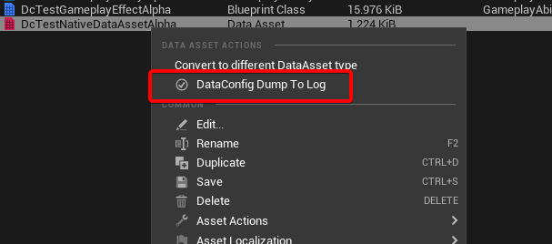
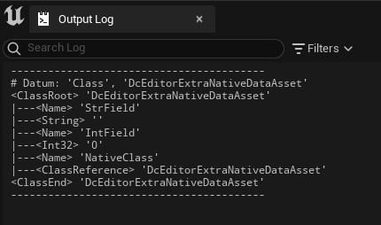

# Dump Asset To Log

In this example we added a `Dump Asset To Log` menu entry. After enabling it you can see it on the context menu on all asset types:



On clicking it would use the pretty print writer to dump the asset into Output Log:



This is implemented as an editor menu extender:


* [DcEditorDumpAssetToLog.cpp]({{SrcRoot}}DataConfigExtra/Private/DataConfig/EditorExtra/Editor/DcEditorDumpAssetToLog.cpp)

```c++
// DataConfigExtra/Private/DataConfig/EditorExtra/Editor/DcEditorDumpAssetToLog.cpp
TSharedRef<FExtender> DumpAssetToLogExtender(const TArray<FAssetData>& SelectedAssets)
{
    // ...
    Extender->AddMenuExtension("GetAssetActions", EExtensionHook::After, TSharedPtr<FUICommandList>(),
        FMenuExtensionDelegate::CreateLambda([Asset](FMenuBuilder& MenuBuilder)
        {
        MenuBuilder.AddMenuEntry(
        // ...
        FUIAction(
            FExecuteAction::CreateLambda([Asset]{
                if (UBlueprint* Blueprint = Cast<UBlueprint>(Asset.GetAsset()))
                {
                    //  dump BP class generated class CDO as it makes more sense
                    DcAutomationUtils::DumpToLog(FDcPropertyDatum(Blueprint->GeneratedClass->ClassDefaultObject));
                }
                else
                {
                    DcAutomationUtils::DumpToLog(FDcPropertyDatum(Asset.GetAsset()));
                }
                }),
                FCanExecuteAction()
            )
        );
        }));
    }
    // ...
```

When asset is a Blueprint we dump its CDO instead as it makes more sense.
