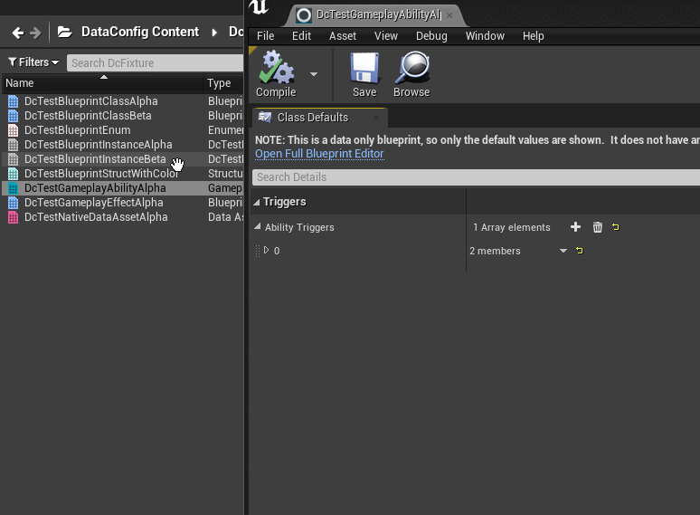

# Deserialize Gameplay Abilities

We'll conclude with a concrete user story: populating `GameplayAbility` and `GameplayEffect` blueprint from JSON file.

* [DcDeserializeGameplayAbility.h]({{SrcRoot}}DataConfigEditorExtra/Public/DataConfig/EditorExtra/Deserialize/DcDeserializeGameplayAbility.h)
* [DcDeserializeGameplayAbility.cpp]({{SrcRoot}}DataConfigEditorExtra/Private/DataConfig/EditorExtra/Deserialize/DcDeserializeGameplayAbility.cpp)

[Gameplay Ability System][1] is a built-in plugin for building data driven abilities. Users are expected to derived and modify `GameplayAbility` and `GameplayEffect` blueprint for custom logic. 

Given a JSON like this:

```c++
// DataConfig/Tests/Fixture_AbilityAlpha.json
{
    /// Tags
    "AbilityTags" : [
        "DataConfig.Foo.Bar",
        "DataConfig.Foo.Bar.Baz",
    ],
    "CancelAbilitiesWithTag" : [
        "DataConfig.Foo.Bar.Baz",
        "DataConfig.Tar.Taz",
    ],
    /// Costs
    "CostGameplayEffectClass" : "/DataConfig/DcFixture/DcTestGameplayEffectAlpha",
    /// Advanced
    "ReplicationPolicy" : "ReplicateYes",
    "InstancingPolicy" : "NonInstanced",
}
```

Right click on a `GameplayAbility` blueprint asset and select `Load From JSON`， then select this file and confirm. It would correctly populate the fields with the values in JSON, as seen in the pic below:



Most of the logic is in `DataConfig/EditorExtra/Deserialize/DcDeserializeGameplayAbility.cpp`:

- The context menu is added from `GameplayAbilityEffectExtender`. There's another handy item named `Dump To Log` which dumps any blueprint CDO into the log.
- DataConfig deserializer is setup in `LazyInitializeDeserializer()`. We added custom logic for deserializing `FGameplayAttribute` from a string like `DcTestAttributeSet.Mana`.
- We also reused many methods from previous examples to support `FGameplayTag` deserialization and Blueprint class look up by path.

[1]: https://docs.unrealengine.com/en-US/InteractiveExperiences/GameplayAbilitySystem/index.html "Gameplay Ability System"