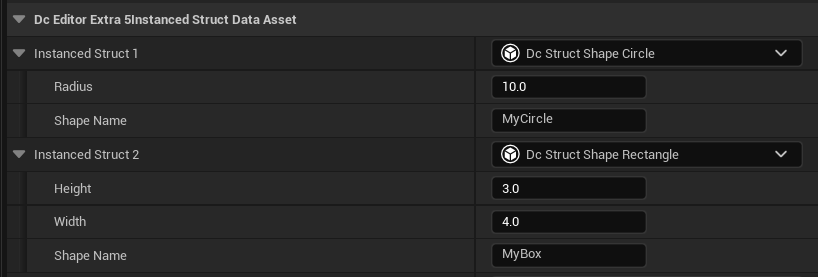

# InstancedStruct

**This example only works with UE5.0+**

Starting with UE 5.0 there's a new plugin [StructUtils][1] featuring a struct type called [FInstancedStruct][2]. It's shares the same idea to previous [AnyStruct](./AnyStruct.md) example, while it has proper asset serialization logic and editor support.

Given a struct hierarchy like this:

```c++
// DataConfigExtra/Public/DataConfig/Extra/Types/DcExtraTestFixtures.h
USTRUCT(BlueprintType)
struct FDcStructShapeBase
{
    GENERATED_BODY()
    
    UPROPERTY(EditAnywhere) FName ShapeName;
};

USTRUCT(BlueprintType)
struct FDcStructShapeRectangle : public FDcStructShapeBase
{
    GENERATED_BODY()
    
    UPROPERTY(EditAnywhere) float Height;
    UPROPERTY(EditAnywhere) float Width;
};

USTRUCT(BlueprintType)
struct FDcStructShapeCircle : public FDcStructShapeBase
{
    GENERATED_BODY()
    
    UPROPERTY(EditAnywhere) float Radius;
};
```

You can use `FInstancedStruct` specified with a `BaseStruct` meta to reference to a polymorphism instance:

```c++
// DataConfigEditorExtra5/Public/DataConfig/EditorExtra/SerDe/DcSerDeInstancedStruct.h
UPROPERTY(EditAnywhere, meta = (BaseStruct = "/Script/DataConfigExtra.DcStructShapeBase"))
FInstancedStruct InstancedStruct1;

UPROPERTY(EditAnywhere, meta = (BaseStruct = "DcStructShapeBase"))
FInstancedStruct InstancedStruct2;
```

The best part is that the editor is also working as intended:



Prior to this you'll need to setup [Sub Objects](../Formats/JSON.md#sub-objects) for similar behavior, which costs unnecessary overhead.

`FInstancedStruct` can also be serialized to and from JSON with DataConfig:


* [DcSerDeInstancedStruct.h]({{SrcRoot}}DataConfigExtra5/Public/DataConfig/EditorExtra/SerDe/DcSerDeInstancedStruct.h)
* [DcSerDeInstancedStruct.cpp]({{SrcRoot}}DataConfigExtra5/Private/DataConfig/EditorExtra/SerDe/DcSerDeInstancedStruct.cpp)

```c++
// DataConfigExtra5/Public/DataConfig/EditorExtra/SerDe/DcSerDeInstancedStruct.h
USTRUCT()
struct FDcEditorExtra5InstancedStruct1
{
    GENERATED_BODY()

    UPROPERTY() FInstancedStruct InstancedStruct1;
    UPROPERTY() FInstancedStruct InstancedStruct2;
    UPROPERTY() FInstancedStruct InstancedStruct3;
};

// DataConfigExtra5/Private/DataConfig/EditorExtra/SerDe/DcSerDeInstancedStruct.cpp
FString Str = TEXT(R"(
    {
        "InstancedStruct1" : {
            "$type" : "DcExtraTestSimpleStruct1",
            "NameField" : "Foo"
        },
        "InstancedStruct2" : {
            "$type" : "DcExtraTestStructWithColor1",
            "ColorField1" : "#0000FFFF",
            "ColorField2" : "#FF0000FF"
        },
        "InstancedStruct3" : null
    }
)");
```

Note how the custom `FColor <-> "#RRGGBBAA"` conversion recursively works within `FInstancedStruct`. 


[1]: https://docs.unrealengine.com/5.0/en-US/API/Plugins/StructUtils/
[2]: https://docs.unrealengine.com/5.0/en-US/API/Plugins/StructUtils/FInstancedStruct/

