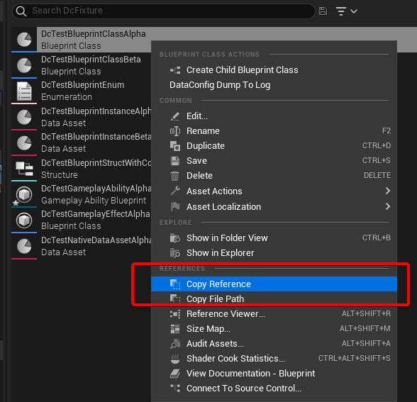

# JSON

[JSON][1] is likely the most popular data interchange format. Unreal Engine already supports it with [`JsonUtilities`][2] and some related modules. We provide an alternative implementation along with DataConfig.

## JSON Reader

`FDcJsonReader` is the DataConfig JSON reader:

```c++
// DataConfigTests/Private/DcTestBlurb.cpp
FString Str = TEXT(R"(
    {
        "Str":    "Fooo",
        "Number": 1.875,
        "Bool":   true
    } 
)");

FDcJsonReader Reader(Str);

//  calling read methods
FString KeyStr;
FString GotStr;
double GotNumber;
bool GotBool;

DC_TRY(Reader.ReadMapRoot());

    DC_TRY(Reader.ReadString(&KeyStr));
    DC_TRY(Reader.ReadString(&GotStr));

    DC_TRY(Reader.ReadString(&KeyStr));
    DC_TRY(Reader.ReadDouble(&GotNumber));

    DC_TRY(Reader.ReadString(&KeyStr));
    DC_TRY(Reader.ReadBool(&GotBool));

DC_TRY(Reader.ReadMapEnd());

//  validate results
check(GotStr == TEXT("Fooo"));
check(GotNumber == 1.875);
check(GotBool == true);
```

In the example above we deserialized a `JSON` object from string. The first and last calls are `ReadMapRoot` and `ReadMapEnd`, which are also used to read Unreal's `TMap` properties. The difference is that UE's `TMap` is strictly typed while JSON object values can have arbitrary type. This means that if you use `FDcPipeVisitor` to pipe a `FDcJsonReader` into a `FDcPropertyWriter` it won't work.

Remember that DataConfig data model is designed to support conversion between subsets within the data model. As long as you can use `FDcReader/FDcWriter` API to describe the format you want to serialize you're good to go. Mapping and conversion between these different shapes of reader/writers are handled by [deserializers](../Programming/SerializerDeserializer.md).

Some additional caveats:

- Similar to stock `TJsonReader`, we provide `TDcJsonReader` with 2 specializations:
    - Usually you just use `FDcJsonReader` that reads from `FString, TCHAR*`.  
    - Under the hood there're `FDcAnsiJsonReader` that reads ANSICHAR string
      and `FDcWideJsonReader` that reads WIDECHAR string.
- We support a relaxed superset of JSON:
    - Allow C Style comments, i.e `/* block */` and `// line` .
    - Allow trailing comma, i.e `[1,2,3,],` .
    - Allow non object root. You can put a list as the root, or even string, numbers.
- Number parsing are delegated to Unreal's built-ins to reduce dependencies. We might change this in the future.
    - Parse numbers: `TCString::Atof/Strtoi/Strtoi64`

## JSON Writer

`FDcJsonWriter` is the DataConfig JSON writer:

```c++
// DataConfigTests/Private/DcTestBlurb.cpp
FDcJsonWriter Writer;

DC_TRY(Writer.WriteMapRoot());

    DC_TRY(Writer.WriteString(TEXT("Str")));
    DC_TRY(Writer.WriteString(TEXT("Fooo")));

    DC_TRY(Writer.WriteString(TEXT("Number")));
    DC_TRY(Writer.WriteFloat(1.875f));

    DC_TRY(Writer.WriteString(TEXT("Bool")));
    DC_TRY(Writer.WriteBool(true));

DC_TRY(Writer.WriteMapEnd());
Writer.Sb.Append(TCHAR('\n'));

FString Str = TEXT(R"(
    {
        "Str" : "Fooo",
        "Number" : 1.875,
        "Bool" : true
    }
)");

//  validate results
check(DcReindentStringLiteral(Str) == Writer.Sb.ToString());
return DcOk();
```

- Similar to stock `TJsonWriter`, we provide `TDcJsonWriter` with 2 specializations:
    - Usually you just use `FDcJsonWriter` that writes `FString, TCHAR*`.  
    - Under the hood there're `FDcAnsiJsonWriter` that writes ANSICHAR string
      and `FDcWideJsonWriter` that writes WIDECHAR string.
- It takes a `Config` object that specify formatting settings like indentation size and new lines.
    - `FDcPrettyJsonWriter` is a type alias that formats indented JSON.
    - `FDcCondensedJsonWriter` is a type alias that format single line, condensed output. 
- `FDcJsonWriter` owns the output string buffer, in `FDcJsonWriter::Sb`.
    - By writing to a single writer and appending a new line after each serialization, we can output [NDJSON][3]. 
    - Our JSON reader is also flexible enough to directly load NDJSON. See [corpus benchmark](../Advanced/Benchmark.md). 


## JSON Serialize/Deserialize

DataConfig bundles a set of JSON serialize and deserialize handlers, which are all roundtrip-able:

```c++
// DataConfigTests/Private/DcTestBlurb.cpp
#include "DataConfig/Deserialize/DcDeserializerSetup.h"

// ...
//  create and setup a deserializer
FDcDeserializer Deserializer;
DcSetupJsonDeserializeHandlers(Deserializer);

//  create and setup a serializer
FDcSerializer Serializer;
DcSetupJsonSerializeHandlers(Serializer);
```


### Schema

JSON types get mapped into DataConfig data model in a very unsurprising way.

| JSON Type | DcDataEntry              |
| :-------- | ------------------------ |
| Boolean   | Bool                     |
| Null      | Nil                      |
| String    | String, Name, Text, Enum |
| Number    | (All numerics)           |
| Array     | Array, Set               |
| Object    | Class, Struct, Map       |

Here's an example:

```c++
// DataConfigTests/Private/DcTestDeserialize.cpp
FString Str = TEXT(R"(
    {
        "BoolField" : true,
        "NameField" : "AName",
        "StringField" : "AStr",
        "TextField" : "AText",
        "EnumField" : "Tard",

        "FloatField" : 17.5,
        "DoubleField" : 19.375,

        "Int8Field" : -43,
        "Int16Field" : -2243,
        "Int32Field" : -23415,
        "Int64Field" : -1524523,

        "UInt8Field" : 213,
        "UInt16Field" : 2243,
        "UInt32Field" : 23415,
        "UInt64Field" : 1524523,
    }
)");

//  deserialized equivelent

FDcTestStruct1 Expect;
Expect.BoolField = true;
Expect.NameField = TEXT("AName");
Expect.StringField = TEXT("AStr");
Expect.TextField = FText::FromString(TEXT("AText"));
Expect.EnumField = EDcTestEnum1::Tard;

Expect.FloatField = 17.5f;
Expect.DoubleField = 19.375;

Expect.Int8Field = -43;
Expect.Int16Field = -2243;
Expect.Int32Field = -23415;
Expect.Int64Field = -1524523;

Expect.UInt8Field = 213;
Expect.UInt16Field = 2243,
Expect.UInt32Field = 23415;
Expect.UInt64Field = 1524523;
```

### Map

JSON only allow string as object/mapping keys, while in UE `TMap<>` can use any type. When doing serialization `TMap<FString/FName/FText,(TValue)>` types would be directly converted to a JSON object:

```c++
// DataConfigTests/Public/DcTestDeserialize.h
USTRUCT()
struct FDcTestStruct3
{
    // ...
    UPROPERTY() TMap<FString, FString> StringMap;
};

// DataConfigTests/Public/DcTestDeserialize.cpp
{
    // ...
    "StringMap" : {
        "One": "1",
        "Two": "2", 
        "Three": "3",
    },
}
```

For other key types it would be serialized as an array of objects:

```c++
// DataConfigTests/Public/DcTestSerDe.h
USTRUCT()
struct FDcTestStructMaps
{
    // ...
    UPROPERTY() TMap<FColor, FString> ColorKeyMap;
    UPROPERTY() TMap<EDcTestEnumFlag, FString> EnumFlagsMap;
};

// DataConfigTests/Public/DcTestDeserialize.cpp
{
    "ColorKeyMap" : {
        "#FF0000FF" : "Red",
        "#00FF00FF" : "Green",
        "#0000FFFF" : "Blue"
    },
    "EnumFlagsMap" : [
        {
            "$key" : [],
            "$value" : "None"
        },
        {
            "$key" : [
                "One",
                "Three"
            ],
            "$value" : "One | Three"
        },
        {
            "$key" : [
                "Five"
            ],
            "$value" : "Five"
        }
    ]
}
```

### Enum Flags

`UENUM` that get marked with `Bitflags` meta are deserialized from a list of strings:

```c++
// DataConfigTests/Public/DcTestDeserialize.h
UENUM(meta = (Bitflags))
enum class EDcTestEnumFlag :uint32
{
    None    = 0,
    One     = (1 << 0),
    Two     = (1 << 1),
    //...
};
ENUM_CLASS_FLAGS(EDcTestEnumFlag);

// DataConfigTests/Private/DcTestDeserialize.cpp
FString Str = TEXT(R"(
    {
        "EnumFlagField1" : [],
        "EnumFlagField2" : ["One", "Three", "Five"],
    }
)");

//  deserialized equivelent
FDcTestStructEnumFlag1 Expect;
Expect.EnumFlagField1 = EDcTestEnumFlag::None;
Expect.EnumFlagField2 = EDcTestEnumFlag::One | EDcTestEnumFlag::Three | EDcTestEnumFlag::Five;
```

### Sub Objects

By default we treat `UOBJECT` marked with `DefaultToInstanced, EditInlineNew` and `UPROPERTY` marked with `Instanced` as sub object. In this case we'll actually instantiate new object during deserialization, using `Ctx.TopObject()` as parent:

```c++
// DataConfigTests/Public/DcTestProperty.h
UCLASS(BlueprintType, EditInlineNew, DefaultToInstanced)
class UDcBaseShape : public UObject
{
    //...
    UPROPERTY() FName ShapeName;
};

UCLASS()
class UDcShapeBox : public UDcBaseShape
{
    //...
    UPROPERTY() float Height;
    UPROPERTY() float Width;
};

UCLASS()
class UDcShapeSquare : public UDcBaseShape
{
    //...
    UPROPERTY() float Radius;
};

// DataConfigTests/Public/DcTestDeserialize.h
USTRUCT()
struct FDcTestStructShapeContainer1
{
    GENERATED_BODY()

    UPROPERTY() UDcBaseShape* ShapeField1;
    UPROPERTY() UDcBaseShape* ShapeField2;
    UPROPERTY() UDcBaseShape* ShapeField3;
}USTRUCT()
struct FDcEditorExtraTestObjectRefs1
{
    GENERATED_BODY()

    UPROPERTY() UObject* ObjField1;
    UPROPERTY() UObject* ObjField2;
    UPROPERTY() UObject* ObjField3;
    UPROPERTY() UObject* ObjField4;
};

// DataConfigTests/Private/DcTestDeserialize.cpp
FString Str = TEXT(R"(
    {
        "ShapeField1" :  {
            "$type" : "DcShapeBox",
            "ShapeName" : "Box1",
            "Height" : 17.5,
            "Width" : 1.9375
        },
        "ShapeField2" : {
            "$type" : "DcShapeSquare",
            "ShapeName" : "Square1",
            "Radius" : 1.75,
        },
        "ShapeField3" : null
    }
)");

//  deserialized equivelent
UDcShapeBox* Shape1 = NewObject<UDcShapeBox>();
Shape1->ShapeName = TEXT("Box1");
Shape1->Height = 17.5;
Shape1->Width = 1.9375;
Expect.ShapeField1 = Shape1;

UDcShapeSquare* Shape2 = NewObject<UDcShapeSquare>();
Shape2->ShapeName = TEXT("Square1");
Shape2->Radius = 1.75;
Expect.ShapeField2 = Shape2;

Expect.ShapeField3 = nullptr;
```

Note that criteria for sub object selection can be easily overridden with a new deserialize predicate or alternative `FDcPropertyConfig` when constructing the reader.

Also see [AnyStruct](../Extra/AnyStruct.md), [InlineStruct](../Extra/InlineStruct.md) and [InstancedStruct](../Extra/InstancedStruct.md) for lighter weight alternatives.

### Object and Class Reference

We support multiple ways of referencing a `UObject` in memory or serialized on disk:

```c++
// DataConfigEditorExtra/Private/DataConfig/EditorExtra/Tests/DcTestDeserializeEditor.h
USTRUCT()
struct FDcEditorExtraTestObjectRefs1
{
    GENERATED_BODY()

    UPROPERTY() UObject* ObjField1;
    UPROPERTY() UObject* ObjField2;
    UPROPERTY() UObject* ObjField3;
    UPROPERTY() UObject* ObjField4;
};

// DataConfigEditorExtra/Private/DataConfig/EditorExtra/Tests/DcTestDeserializeEditor.cpp
FString Str = TEXT(R"(
    {
        "ObjField1" : "DcEditorExtraNativeDataAsset'/DataConfig/DcFixture/DcTestNativeDataAssetAlpha.DcTestNativeDataAssetAlpha'",
        "ObjField2" : "/DataConfig/DcFixture/DcTestNativeDataAssetAlpha",
        "ObjField3" : 
        {
            "$type" : "DcEditorExtraNativeDataAsset",
            "$path" : "/DataConfig/DcFixture/DcTestNativeDataAssetAlpha"
        },
        "ObjField4" : null,
    }
)");

//  deserialized equivelent
UDcEditorExtraNativeDataAsset* DataAsset = Cast<UDcEditorExtraNativeDataAsset>(StaticLoadObject(
    UDcEditorExtraNativeDataAsset::StaticClass(),
    nullptr,
    TEXT("/DataConfig/DcFixture/DcTestNativeDataAssetAlpha"),
    nullptr
));

Expect.ObjField1 = DataAsset;
Expect.ObjField2 = DataAsset;
Expect.ObjField3 = DataAsset;
Expect.ObjField4 = nullptr;
```

In the example above, `ObjField1` uses the reference string that can be retrieved in editor context menu:



For `ObjField2/ObjField3`  relative path to the `uasset` is used, but without file name suffix.

We also support class reference fields of `TSubclassOf<>`s:

```c++
// DataConfigTests/Private/DcTestDeserialize.h
USTRUCT()
struct FDcTestStructSubClass1
{
    GENERATED_BODY()

    UPROPERTY() TSubclassOf<UStruct> StructSubClassField1;
    UPROPERTY() TSubclassOf<UStruct> StructSubClassField2;
    UPROPERTY() TSubclassOf<UStruct> StructSubClassField3;
};

// DataConfigTests/Private/DcTestDeserialize.cpp
FString Str = TEXT(R"(
    {
        "StructSubClassField1" : null,
        "StructSubClassField2" : "ScriptStruct",
        "StructSubClassField3" : "DynamicClass",
    }
)");

//  deserialized equivelent
FDcTestStructSubClass1 Expect;
Expect.StructSubClassField1 = nullptr;
Expect.StructSubClassField2 = UScriptStruct::StaticClass();
Expect.StructSubClassField3 = UDynamicClass::StaticClass();
```

Note that these do not support Blueprint classes. The direct reason is that Blueprint depends on `Engine` module and we'd like not to take dependency on in `DataConfigCore`. 

We do have an example that supports Blueprint classes, see `DataConfigEditorExtra - 
DcDeserializeBPClass.h/cpp`

## Soft Lazy as String

`DcSetupJsonSerializeHandlers()/DcSetupJsonDeserializeHandlers()` accepts an enum to setup alternative handlers. For now `StringSoftLazy` branch would setup special `FSoftObjectProperty/FLazyObjectProperty` handlers that directly serialize these into string. Comparing to this the default setup would always resolve the indirect reference into memory, which maybe isn't always desirable. 

```c++
// DataConfigTests/Private/DcTestBlurb.cpp
FDcTestStructRefs1 Source{};
UObject* TestsObject = StaticFindObject(UObject::StaticClass(), nullptr, TEXT("/Script/DataConfigTests"));

Source.SoftField1 = TestsObject;
Source.LazyField1 = TestsObject;

FDcJsonWriter Writer;
DC_TRY(DcAutomationUtils::SerializeInto(&Writer, FDcPropertyDatum(&Source),
[](FDcSerializeContext& Ctx) {
    DcSetupJsonSerializeHandlers(*Ctx.Serializer, EDcJsonSerializeType::StringSoftLazy);
}, DcAutomationUtils::EDefaultSetupType::SetupNothing));

//  serialized result
{
    // ...
    "SoftField1" : "/Script/DataConfigTests",
    "SoftField2" : "",
    "LazyField1" : "C851179E-45A51045-0006AE91-F9B16EC0",
    "LazyField2" : "00000000-00000000-00000000-00000000"
}
```

## Caveats

Here're some closing notes:

- For meta fields like `$type` it must be the first member, meaning object fields are order dependent. This means that the JSON we're supporting is a super set of standard JSON spec (again).

- Bundled serializers and deserializers are designed to be roundtrip-able. For example in test `DataConfig.Core.RoundTrip.JsonRoundtrip1_Default`:
  
  1. Serialize `UDcTestRoundtrip1` instance `Source` into JSON.
  2. Then deserialize JSON above into instance `Dest`.
  3. Deep-compare `Source` and `Dest`. If they're equal them we say it's a roundtrip.

  Note that we carefully picked float and doubles in the test case, as it's tricky to support floating point roundtrip. We might consider supporting this with alternative float parse and format routines.
  
- There're many data types that can not be deserialized from JSON, for example `Delegate/WeakObjectReference`. Remember that you always have the option to override or selectively enable handlers to support additional properties that make sense in your context. See `DcSetupJsonDeserializeHandlers()` body on how handlers are registered. You can skip this method and select the ones you want and provide additional handlers.

- The JSON handlers are designed to *NOT* read anything during the deserialization. This is crucial since `USTRUCT` can contain uninitialized fields. For example:

    ```c++
    // DataConfigTests/Private/DcTestBlurb.cpp
    FString Str = TEXT(R"(
        {
            // pass
        } 
    )");
    FDcJsonReader Reader(Str);
    
    FDcTestExampleSimple Dest;
    FDcPropertyDatum DestDatum(&Dest);
    
    DC_TRY(DcAutomationUtils::DeserializeJsonInto(&Reader, DestDatum));
    
    check(Dest.StrField.IsEmpty());
    //  but Dest.IntField contains uninitialized value
    DcAutomationUtils::DumpToLog(DestDatum);

    // dump results
    <StructRoot> 'DcTestExampleSimple'
    |---<Name> 'StrField'
    |---<String> ''
    |---<Name> 'IntField'
    |---<Int32> '1689777552' // <- arbitrary value
    <StructEnd> 'DcTestExampleSimple'
    ```

    This would cause trouble when you try read a pointer field during deserialization. Remember that primitive fields might be uninitialized during deserialization when implementing your own handlers.
    
- One interesting trait of the pull/push styled API is that `FDcJsonReader` does __not__ preemptively parse number into double and convert it to `int/float` later on. When reading a number token it would do the number parsing at call site. If `ReadIntX()` is called then the number is parsed as integer. If `ReadFloat()/ReadDouble()` is called the token will be parsed as floating point.

[1]: https://www.json.org/json-en.html "Introducing JSON"
[2]: https://docs.unrealengine.com/4.27/en-US/API/Runtime/JsonUtilities/ "JsonUtilities"
[3]: http://ndjson.org/ "ndjson"