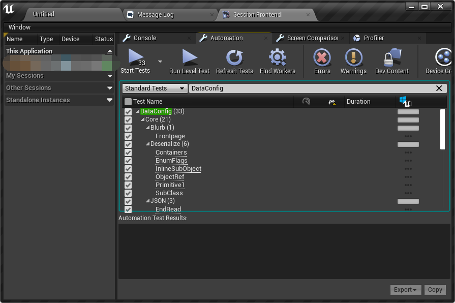

# Integration

At the moment it supports these the engine versions below:

- UE 5.4
- UE 5.3 
- UE 5.2 
- UE 5.1 
- UE 5.0 
- UE 4.27
- UE 4.26
- UE 4.25

## Integrate `DataConfig` Plugin

The easiest way to try out DataConfig is to add it as a plugin into your C++ project.  In this section we'll walk through these steps.

### Download DataConfig Plugin

The quickest way to try out DataConfig is to download the latest release at [DataConfig releases][2] page.

1. Download the zip files on the [releases page][2]. Note there're UE4 and UE5 plugin respectively.

2. Unzip it into your Unreal Engine project's `Plugin` folder. The layout should be like this:

```
<Your project root>
|- <Your project>.uproject
|- Content
|- Source
|- ...
|- Plugins
   |- DataConfig
      |- DataConfig.uplugin
```

3. [Validate DataConfig plugin is integrated corrrectly](#validate-integration).


### Generate DataConfig Plugin for UE4/UE5

DataConfig now uses separated `uplugin` files for UE4 and UE5 so that we can try out new features in UE5 without dropping support for UE4. We bundled scripts to generate clean plugins for UE4 and UE5. This is how the [DataConfig releases][2] are built.

```shell
git clone https://github.com/slowburn-dev/DataConfig
# requires python 3.6+
python ./DataConfig/Misc/Scripts/make_dataconfig_ue4.py
python ./DataConfig/Misc/Scripts/make_dataconfig_ue5.py
```

### Manual Steps for UE5

1. Get a copy of [DataConfig repository][1]. Then copy  `./DataConfig` (where `DataConfig.uplugin` is located) into your project's `Plugins` directory.

2. Delete `DataConfig4.uplugin`.

3. **Delete `DataConfig/Source/DataConfigHeadless`** folder. **This step is crucial or you your project won't build**.

### Manual Steps for UE4

1. Get a copy of [the repository][1]. Then copy  `./DataConfig` (where `DataConfig.uplugin` is located) into your project's `Plugins` directory.

2. Delete `DataConfig.uplugin`, then rename `DataConfig4.uplugin` to `DataConfig.uplugin`.

3. **Delete `DataConfig/Source/DataConfigHeadless`** folder. **This step is crucial or you your project won't build**.

4. Additionally delete UE5 specific modules.
    
    * `DataConfig/Source/DataConfigEditorExtra5`

### Validate integration

Follow these steps to ensure DataConfig is properly integrated into your project.

1. Restart your project. There should be a prompt to compile plugin sources. Confirm and wait until your project launches. Then open `Settings -> Plugins` you should see **Data Config** listed under Project Editor category.

   

2. The plugin comes with a set of tests. Open menu `Window -> Developer Tools  -> Session Frontend`. Find and run the `DataConfig` tests and it should all pass.

   

## Integrate `DataConfigCore` Module

DataConfig is packed into a plugin to bundle automation tests with a few assets. You're encouraged to integrate only the `DataConfigCore` module. It contains all core features with minimal dependencies. 

Most projects should has a editor module already setup. In this section we'll go through the steps of integrating `DataConfigCore` and build it with the project's `FooProjectEditor` module.

1. Get a copy of this repository. Then copy `DataConfig/Source/DataConfigCore` into your project's `Source` directory.

2. Edit `FooProjectEditor.Build.cs` add add `DataConfigCore` as an extra module:

   ```c++
   using UnrealBuildTool;
   
   public class FooProjectEditor : ModuleRules
   {
       public FooProjectEditor(ReadOnlyTargetRules Target) : base(Target)
       {
           PublicDependencyModuleNames.AddRange(new string[] { 
   			//...
               "DataConfigCore",	// <- add this
               });
       }
   }
   ```

3. DataConfig needs to be explicitly initialized before use. Find `FooProjectEditor` module's start up and shut down methods and setup DataConfig accordingly.

   ```c++
   #include "DataConfig/DcEnv.h"
   #include "DataConfig/Automation/DcAutomationUtils.h"
   
   void FFooProjectEditorModule::StartupModule()
   {
       // ...
       DcStartUp(EDcInitializeAction::SetAsConsole);
       // dump a FVector to try it out
       FVector Vec(1.0f, 2.0f, 3.0f);
       FDcPropertyDatum VecDatum(TBaseStructure<FVector>::Get(), &Vec);
   
       DcAutomationUtils::DumpToLog(VecDatum);
   }
   
   void FFooProjectEditorModule::ShutdownModule()
   {
       // ...
   	DcShutDown();
   }
   ```
   
4. Rebuild the project and restart the editor. Open `Output Log` and you should be able to find the dump results (to filter use `Categories -> None` ).

   
   
   

You can refer to [Module Setup](Extra/ModuleSetup.md) for more detailed integration instructions.

[1]:https://github.com/slowburn-dev/DataConfig "slowburn-dev/DataConfig"
[2]:https://github.com/slowburn-dev/DataConfig/releases

