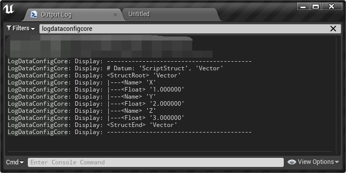

# Integration

This page shows integration instructions for DataConfig. At the moment it supports these the engine versions below:

- UE 4.25
- UE 4.26

## Integrate `DataConfig` Plugin

The easiest way to try out DataConfig is to add it as a plugin into your C++ project.  In this section we'll walk through the steps of integrating DataConfig plugin into a empty UE C++ Project.

1. Get a copy of [the repository][1]. Then copy  `./DataConfig` (where `DataConfig.uplugin` is located) into your project's `Plugins` directory.

2. **Delete `DataConfig\Source\DataConfigHeadless`** folder. It has a `DataConfigHeadless.Target.cs` file which is a hack to build a headless binary during development. **This step is crucial or you your project won't build**.

3. Restart your project. There should be a prompt to compile plugin sources. Confirm and wait until your project launches. Then open `Settings -> Plugins` you should see **Data Config** listed under Project Editor category.

   

4. The plugin comes with a set of tests. Open menu `Window -> Developer Tools  -> Session Frontend`. Find and run the `DataConfig` tests and it should all pass.

   

## Integrate `DataConfigCore` Module

DataConfig is packed into a plugin to bundle automation tests with a few assets. You're encouraged to integrate only the `DataConfigCore` module. It contains all core features with minimal dependencies. 

Most projects should has a editor module already setup. In this section we'll go through the steps of integrating `DataConfigCore` and build it with the project's `FooProjectEditor` module.

1. Get a copy of this repository. Then copy `DataConfig/Source/DataConfigCore` into your project's `Source` directory.

2. Edit `FooProjectEditor.Build.cs` add add `DataConfigCore` as an extra module:

   ```c++
   using UnrealBuildTool;
   
   public class FooProjectEditor : ModuleRules
   {
       public FooProjectEditor(ReadOnlyTargetRules Target) : base(Target)
       {
           PublicDependencyModuleNames.AddRange(new string[] { 
   			//...
               "DataConfigCore",	// <- add this
               });
       }
   }
   ```

3. DataConfig needs to be explicitly initialized before use. Find `FooProjectEditor` module's start up and shut down methods and setup DataConfig accordingly.

   ```c++
   #include "DataConfig/DcEnv.h"
   #include "DataConfig/Automation/DcAutomationUtils.h"
   
   void FFooProjectEditorModule::StartupModule()
   {
       // ...
       DcStartUp(EDcInitializeAction::SetAsConsole);
       // dump a FVector to try it out
       FVector Vec(1.0f, 2.0f, 3.0f);
       FDcPropertyDatum VecDatum(TBaseStructure<FVector>::Get(), &Vec);

       DcAutomationUtils::DumpToLog(VecDatum);
   }
   
   void FFooProjectEditorModule::ShutdownModule()
   {
       // ...
   	DcShutDown();
   }
   ```
   
4. Rebuild the project and restart the editor. Open `Output Log` and use `LogDataConfigCore` filter and find the dump output. 

   

You can refer to `DataConfigEditorExtra` module for more detailed integration options.

[1]:https://github.com/slowburn-dev/DataConfig "slowburn-dev/DataConfig"

