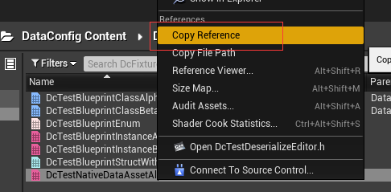

# Deserialize JSON

DataConfig bundles a set of JSON deserialize handlers. Setup by calling `DcSetupJsonDeserializeHandlers()`:

```c++
// DataConfig/Source/DataConfigTests/Private/DcTestBlurb.cpp
#include "DataConfig/Deserialize/DcDeserializerSetup.h"

//...
//  create and setup a deserializer
FDcDeserializer Deserializer;
DcSetupJsonDeserializeHandlers(Deserializer);
```

## Basics

JSON types get mapped into DataConfig data model in a very unsurprising way.

| JSON Type | DcDataEntry              |
| :-------- | ------------------------ |
| Boolean   | Bool                     |
| Null      | Nil                      |
| String    | String, Name, Text, Enum |
| Number    | (All numerics)           |
| Array     | Array, Set               |
| Object    | Class, Struct, Map       |

Here's an example:

```c++
// DataConfig/Source/DataConfigTests/Private/DcTestDeserialize.cpp
FString Str = TEXT(R"(
    {
        "BoolField" : true,
        "NameField" : "AName",
        "StringField" : "AStr",
        "TextField" : "AText",
        "EnumField" : "Tard",

        "FloatField" : 17.5,
        "DoubleField" : 19.375,

        "Int8Field" : -43,
        "Int16Field" : -2243,
        "Int32Field" : -23415,
        "Int64Field" : -1524523,

        "UInt8Field" : 213,
        "UInt16Field" : 2243,
        "UInt32Field" : 23415,
        "UInt64Field" : 1524523,
    }
)");

//  deserialized equivelent

FDcTestStruct1 Expect;
Expect.BoolField = true;
Expect.NameField = TEXT("AName");
Expect.StringField = TEXT("AStr");
Expect.TextField = FText::FromString(TEXT("AText"));
Expect.EnumField = EDcTestEnum1::Tard;

Expect.FloatField = 17.5f;
Expect.DoubleField = 19.375;

Expect.Int8Field = -43;
Expect.Int16Field = -2243;
Expect.Int32Field = -23415;
Expect.Int64Field = -1524523;

Expect.UInt8Field = 213;
Expect.UInt16Field = 2243,
Expect.UInt32Field = 23415;
Expect.UInt64Field = 1524523;
```

## Enum Flags

`UENUM` that get marked with `Bitflags` meta are deserialized from a list of strings:

```c++
// DataConfig/Source/DataConfigTests/Public/DcTestDeserialize.h
UENUM(meta = (Bitflags))
enum class EDcTestEnumFlag :uint32
{
    None    = 0,
    One     = (1 << 0),
    Two     = (1 << 1),
    //...
};
ENUM_CLASS_FLAGS(EDcTestEnumFlag);

// DataConfig/Source/DataConfigTests/Private/DcTestDeserialize.cpp
FString Str = TEXT(R"(
    {
        "EnumFlagField1" : [],
        "EnumFlagField2" : ["One", "Three", "Five"],
    }
)");

//  deserialized equivelent
FDcTestStructEnumFlag1 Expect;
Expect.EnumFlagField1 = EDcTestEnumFlag::None;
Expect.EnumFlagField2 = EDcTestEnumFlag::One | EDcTestEnumFlag::Three | EDcTestEnumFlag::Five;
```

## Sub Objects

By default We treat `UOBJECT` marked with `DefaultToInstanced, EditInlineNew` and `UPROPERTY` marked with `Instanced` as subobject. In this case we'll actually instantiate new object during deserialization, using `Ctx.TopObject()` as parent:

```c++
// DataConfig/Source/DataConfigTests/Public/DcTestProperty.h
UCLASS(BlueprintType, EditInlineNew, DefaultToInstanced)
class UDcBaseShape : public UObject
{
    //...
    UPROPERTY() FName ShapeName;
};

UCLASS()
class UDcShapeBox : public UDcBaseShape
{
    //...
    UPROPERTY() float Height;
    UPROPERTY() float Width;
};

UCLASS()
class UDcShapeSquare : public UDcBaseShape
{
    //...
    UPROPERTY() float Radius;
};

// DataConfig/Source/DataConfigTests/Public/DcTestDeserialize.h
USTRUCT()
struct FDcTestStructShapeContainer1
{
    GENERATED_BODY()

    UPROPERTY() UDcBaseShape* ShapeField1;
    UPROPERTY() UDcBaseShape* ShapeField2;
    UPROPERTY() UDcBaseShape* ShapeField3;
}USTRUCT()
struct FDcEditorExtraTestObjectRefs1
{
    GENERATED_BODY()

    UPROPERTY() UObject* ObjField1;
    UPROPERTY() UObject* ObjField2;
    UPROPERTY() UObject* ObjField3;
    UPROPERTY() UObject* ObjField4;
};


;

// DataConfig/Source/DataConfigTests/Private/DcTestDeserialize.cpp
FString Str = TEXT(R"(
    {
        "ShapeField1" :  {
            "$type" : "DcShapeBox",
            "ShapeName" : "Box1",
            "Height" : 17.5,
            "Width" : 1.9375
        },
        "ShapeField2" : {
            "$type" : "DcShapeSquare",
            "ShapeName" : "Square1",
            "Radius" : 1.75,
        },
        "ShapeField3" : null
    }
)");

//  deserialized equivelent
UDcShapeBox* Shape1 = NewObject<UDcShapeBox>();
Shape1->ShapeName = TEXT("Box1");
Shape1->Height = 17.5;
Shape1->Width = 1.9375;
Expect.ShapeField1 = Shape1;

UDcShapeSquare* Shape2 = NewObject<UDcShapeSquare>();
Shape2->ShapeName = TEXT("Square1");
Shape2->Radius = 1.75;
Expect.ShapeField2 = Shape2;

Expect.ShapeField3 = nullptr;
```

Note that the sub object criteria can be easily overridden with a new deserialize predicate or alternative `FDcPropertyConfig` when constructing the reader.

## Object and Class Reference

We support multiple ways of referencing a `UObject` in memory or serialized on disk:

```c++
// DataConfig/Source/DataConfigEditorExtra/Private/DataConfig/EditorExtra/Tests/DcTestDeserializeEditor.h
USTRUCT()
struct FDcEditorExtraTestObjectRefs1
{
    GENERATED_BODY()

    UPROPERTY() UObject* ObjField1;
    UPROPERTY() UObject* ObjField2;
    UPROPERTY() UObject* ObjField3;
    UPROPERTY() UObject* ObjField4;
};

// DataConfig/Source/DataConfigEditorExtra/Private/DataConfig/EditorExtra/Tests/DcTestDeserializeEditor.cpp
FString Str = TEXT(R"(
    {
        "ObjField1" : "DcEditorExtraNativeDataAsset'/DataConfig/DcFixture/DcTestNativeDataAssetAlpha.DcTestNativeDataAssetAlpha'",
        "ObjField2" : "/DataConfig/DcFixture/DcTestNativeDataAssetAlpha",
        "ObjField3" : 
        {
            "$type" : "DcEditorExtraNativeDataAsset",
            "$path" : "/DataConfig/DcFixture/DcTestNativeDataAssetAlpha"
        },
        "ObjField4" : null,
    }
)");

//  deserialized equivelent
UDcEditorExtraNativeDataAsset* DataAsset = Cast<UDcEditorExtraNativeDataAsset>(StaticLoadObject(
    UDcEditorExtraNativeDataAsset::StaticClass(),
    nullptr,
    TEXT("/DataConfig/DcFixture/DcTestNativeDataAssetAlpha"),
    nullptr
));

Expect.ObjField1 = DataAsset;
Expect.ObjField2 = DataAsset;
Expect.ObjField3 = DataAsset;
Expect.ObjField4 = nullptr;
```

In the example above, `ObjField1` is using the reference string that can be retrieved in editor context menu:



For `ObjField2/ObjField3` it's using a relative path to the `uasset` but without file name suffix.

We also support class reference fields of `TSubclassOf<>`s:

```c++
// DataConfig/Source/DataConfigTests/Private/DcTestDeserialize.h
USTRUCT()
struct FDcTestStructSubClass1
{
    GENERATED_BODY()

    UPROPERTY() TSubclassOf<UStruct> StructSubClassField1;
    UPROPERTY() TSubclassOf<UStruct> StructSubClassField2;
    UPROPERTY() TSubclassOf<UStruct> StructSubClassField3;
};

// DataConfig/Source/DataConfigTests/Private/DcTestDeserialize.cpp
FString Str = TEXT(R"(
    {
        "StructSubClassField1" : null,
        "StructSubClassField2" : "ScriptStruct",
        "StructSubClassField3" : "DynamicClass",
    }
)");

//  deserialized equivelent
FDcTestStructSubClass1 Expect;
Expect.StructSubClassField1 = nullptr;
Expect.StructSubClassField2 = UScriptStruct::StaticClass();
Expect.StructSubClassField3 = UDynamicClass::StaticClass();
```

Note that these do not support Blueprint classes. The direct reason is that Blueprint depends on `Engine` module and we'd like not to take dependency on in `DataConfigCore`. 

We do have an example that supports Blueprint classes, see `DataConfigEditorExtra - 
DcDeserializeBPClass.h/cpp`

## Conclusion

The built-in JSON deserialize handlers are designed to support full JSON data types plus a few common conversion to Unreal objects.

Some closing notes:

- Remember that you always have the option to override or selectively enable the handlers. See `DcSetupJsonDeserializeHandlers()` body how handlers are registered. You can skip this method and select the ones you want and provide additional handlers.

- The JSON handlers are designed to *NOT* read anything during the deserialization. This is crucial since `USTRUCT` can contain uninitialized fields. For example:

    ```c++
    // DataConfig/Source/DataConfigTests/Private/DcTestBlurb.cpp
    FString Str = TEXT(R"(
        {
            // pass
        } 
    )");
    FDcJsonReader Reader(Str);
    
    FDcTestExampleSimple Dest;
    FDcPropertyDatum DestDatum(FDcTestExampleSimple::StaticStruct(), &Dest);
    
    DC_TRY(DcAutomationUtils::DeserializeJsonInto(&Reader, DestDatum));
    
    check(Dest.StrField.IsEmpty());
    //  but Dest.IntField contains uninitialized value
    DcAutomationUtils::DumpToLog(DestDatum);

    // dump results
    <StructRoot> 'DcTestExampleSimple'
    |---<Name> 'StrField'
    |---<String> ''
    |---<Name> 'IntField'
    |---<Int32> '1689777552' // <- arbitrary value
    <StructEnd> 'DcTestExampleSimple'
    ```

    This would cause trouble when you try read a pointer field during deserialization. Remember that primitive fields might be uninitialized during deserialization when implementing your own handlers.

